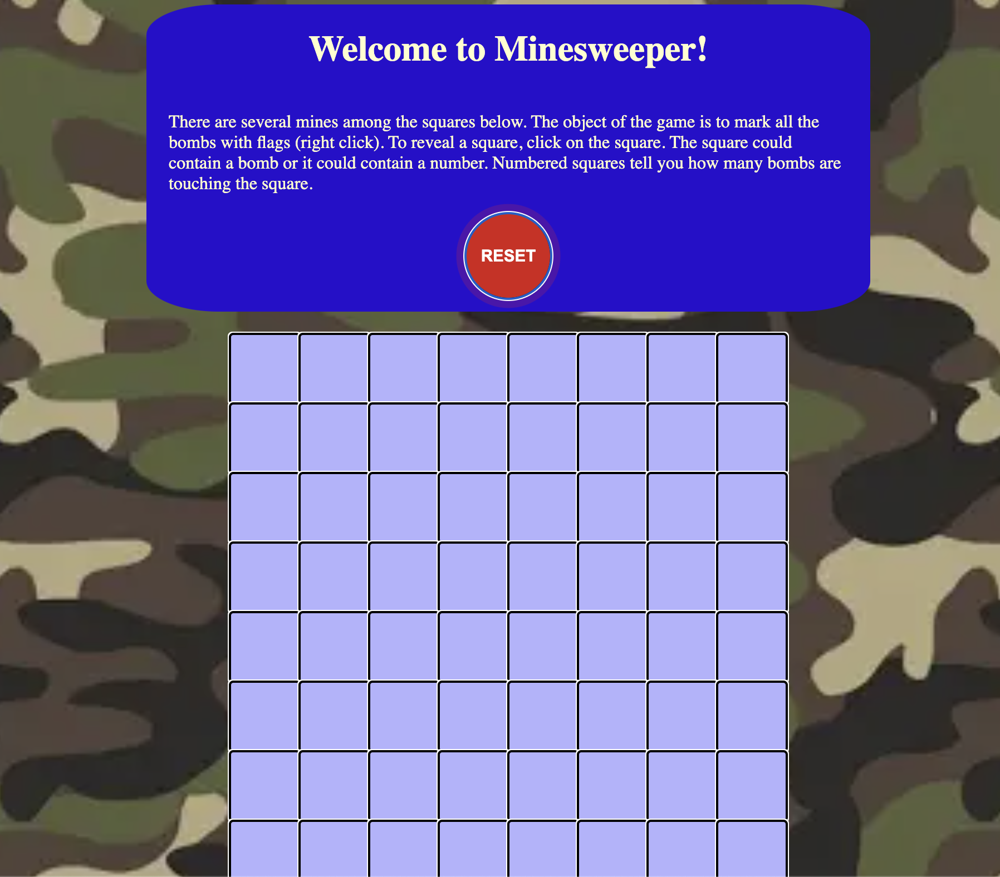

# Project 1 - Minesweeper

> Minesweeper is a game where the object is to locate all the hidden bombs in an array of tiles. Revealing squares can be done with right-clicking, but be careful - it could be a bomb under that tile. Revealed tiles will display a number indicating the number of bombs touching a square. These bombs could be above, below, and diagonal from the square. When you suspect a square is a bomb, right click to mark the square as a bomb. Once all the bombs are marked correctly, you win the game!

## Getting Started
> Follow this [link](https://ckremer99.github.io/minesweeper/) to get to my deployed game. 

## Technologies Used
> The languages used in this application were HTML, CSS, and Javascript.

## Next Steps
> The next steps can be to change the color scheme to make it more visually appealing. I could also animate an explosion in the background to enhance the losing screen. 